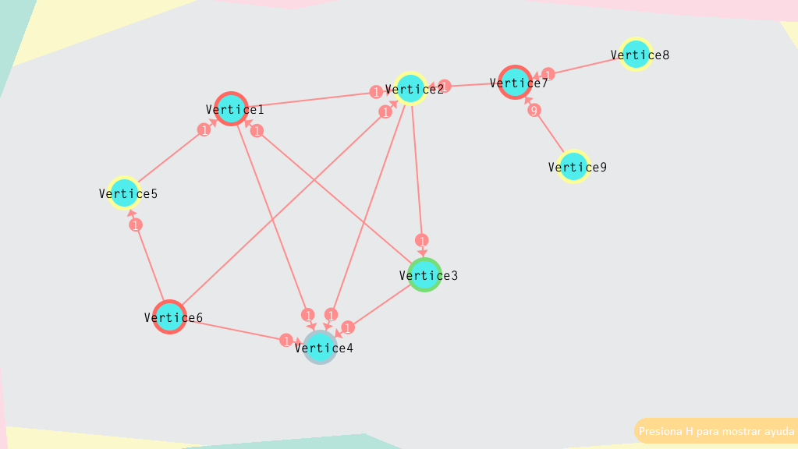
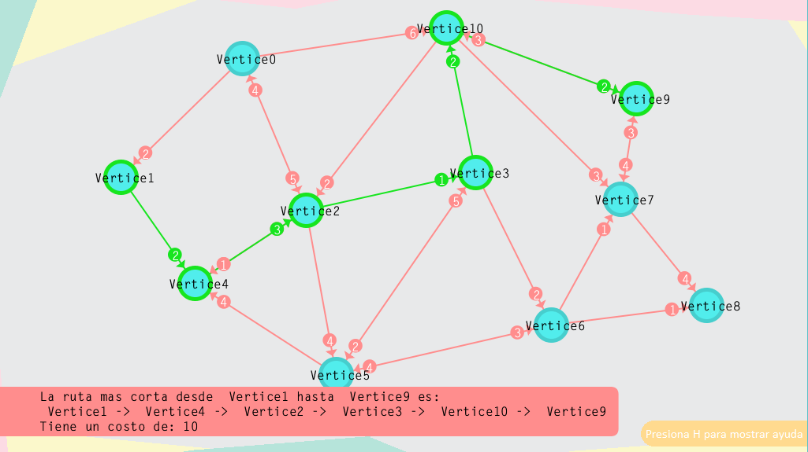
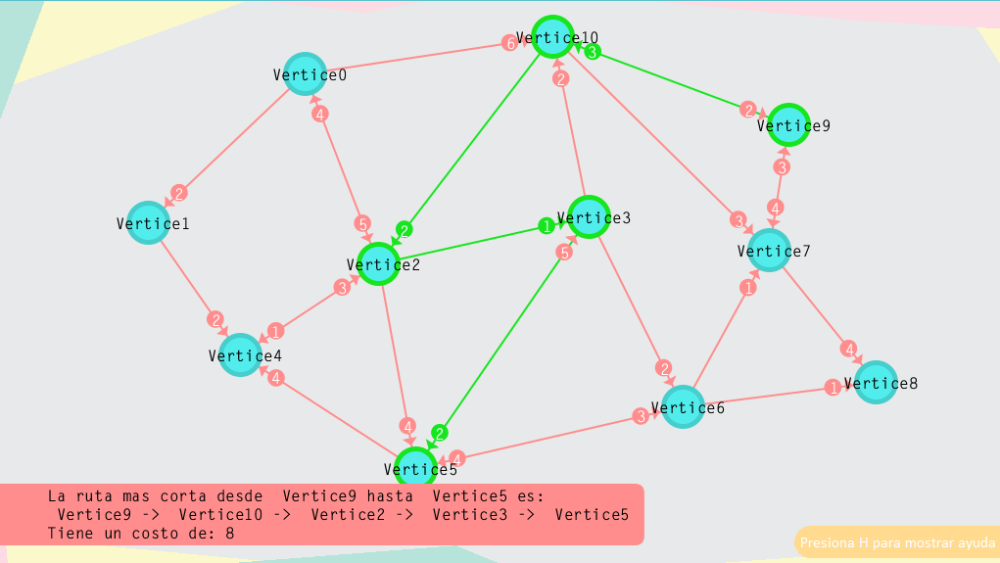
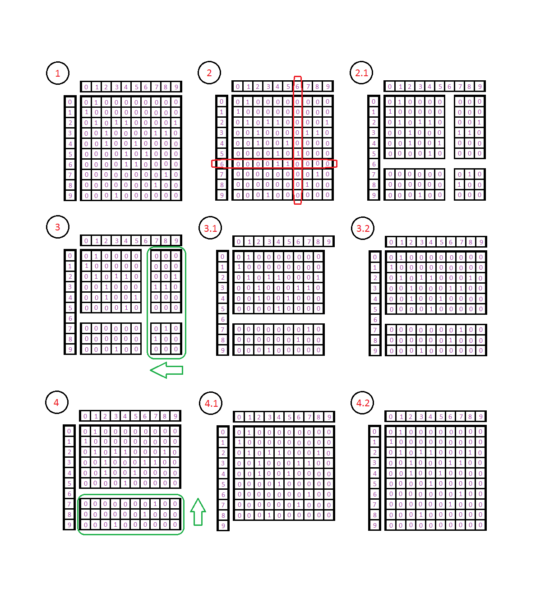
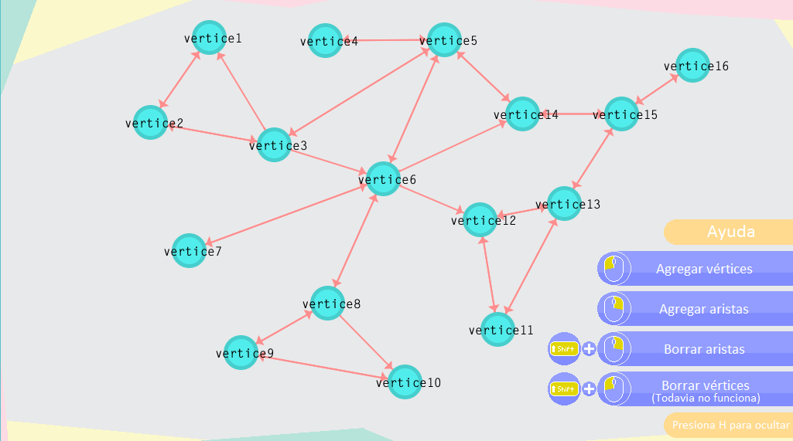

### Proyecto final de la materia "Matemáticas discretas".
Si quieres probar este proyecto te recomiendo ampliamente que lo descargues y lo ejecutes con Processing 3, debido a que la version web del enlace de abajo algunas veces no funciona como debería hacerlo.

- Enlace para ver el proyecto: https://shadic78.github.io/Proyecto-Matematicas-Discretas-Grafos/.
---

## Bitacora
**Notas:**
- En algunos navegadores no funciona el borrar el nombre del vertice debido a que no permiten detectar cuando se presiona
la tecla "BACKSPACE", borrar el nombre del vertice funciona correctamente si ejecutas el archivo de manera local con Processing 3.
- Muchas veces al querer ver el proyecto utilizando el enlace de arriba solo sale una pantalla gris (No he descubierto el motivo), esto se soluciona
recargando la ventana.

##17/05/19
**Añadidos:**
- Se implementó el coloreado de vértices. Esta función puede activarse presionando SHIFT y la tecla 'Z' de nuestro teclado.

**Screenshots**

## 05/05/19

**Añadidos:**
- Se implementó el algoritmo de Dijkstra para buscar la ruta mas corta entre dos vertices. Para activar la busqueda de la ruta mas corta se tiene que dar click izquierdo a dos vertices manteniendo presionado la tecla CONTROL.
- Se agregó que para mostrar la ruta mas corta entre dos vertices los bordes de los vertices y las aristas se resalten con otro color.
- Se agregó que al querer eliminar una arista o al querer usar la ruta mas corta ahora el primer vertice al que le des click se resaltara con otro color.

**Correciones:**
- Se corrigio que antes podias intentar borrar una arista aun si tu grafo solo tenia un vertice, debido a ello el programa se quedaba atorado y tenias que cerrarlo y volver a abrirlo.

**Problemas:**
- Las teclas "auxiliares" se me estan acabando y siento que es muy impractico que al dar click izquierdo o derecho realices una accion y si das click izquierdo o derecho presionando shift o control realices otras acciones distintas, debido a ello estoy considerando reemplazar ese sistema por un verdadero menu de opciones y no solo un "cartel" que te dice que puedes hacer y como hacerlo.

**Screenshots**

## 30/04/19

**Añadidos:**
- Se agrego que el grafo sea ponderado.
- Se agrego la funcionalidad de poder asignarle un "costo" a las aristas (Debido a que el grafo es dirigido los costos de las aristas "de ida y de vuelta" pueden ser distintos).

**Correciones:**
- Se corrigio que cuando borrabas un vertice, si el vertice que borraste es el ultimo que añadiste entonces al momento de colocar un nuevo vertice este nuevo vertice conservaba las aristas del vertice anterior que borraste.

**Screenshots**

## 20/04/19

**Añadidos:**
- Se agrego la funcionalidad de poder borrar vertices al mantener presionado SHIFT y dar click izquierdo sobre un vertice.

**Correciones:**
- Se corrigio que al momento de nombrar un vertice y apretar la tecla 'h' se podia interactuar con el menu de ayuda.
---

**Explicación de parte del proceso que utilice para borrar vertices:**

Para borrar un vertice hay que borrar las aristas que conectan al mismo, el proceso es el siguiente:

1.- Teniendo una matriz de adyacencia que representa al siguiente grafo:

2.- Supongamos que queremos eliminar el vertice "6".

2.1.- Para ello tenemos que visualizar la matriz de esta manera, ahora hay que "unir" los "bloques" que quedaron de la matriz.

3.- "Movemos" una posición a la "izquierda" las columnas que estan una posicion adelante del vertice que queremos eliminar (7, 8, 9)

3.1.- Debido a ello en la ultima columna de la matriz nos queda una "columna vacia".

3.2.- Rellenamos esa "columna vacia" con ceros.

4.- Ahora hay que repetir el proceso pero con las filas, hay que "mover" todas las filas que estan una posicion adelante del vertice
que queremos eliminar (7, 8, 9) una posición "arriba".

4.1.- Nos queda una "fila vacia" en la ultima fila de la matriz.

4.2.- Rellenamos la "fila vacia" con ceros.

De esta manera elimino un vertice de la matriz de adyacencia, pero sumado a esto tambien tengo que eliminar la posición del vertice en los arrayList que utilizo.

## 19/04/19
### SE REDISEÑO LA INTERFAZ GRAFICA.

**Añadidos:**
- Se agrego un "menu de ayuda" en el cual estan las funcionalidades del programa.
- Se agrego dos imagenes correspondientes al menu de ayuda.
- Se agrego una imagen de background.

**Screenshots**

## 18/04/19

**Añadidos:**
- Se agrego la funcionalidad de poder borrar aristas al mantener presionado SHIFT y dar click derecho sobre dos vertices.

## 17/04/19

**Añadidos:**
- Se agrego que el grafo sea dirigido.
- Se agrego una función que permite dibujar flechas.

**Screenshots:**

## 12/04/19
La interfaz grafica esta casi terminada, falta agregar el poder borrar vertices y aristas.

**Añadidos:**
- Se agrego una "matriz de adyacencia", la cual representa al grafo (no dirigido).
- Se agrego el poder agregar aristas al dar clic derecho a dos vertices.

**Correciones:**
- Puedes borrar el nombre del vertice que estes escribiendo.

**Problemas:**
- La matriz que representa al grafo tiene un limite de tamaño.

**Screenshots:**

## 11/04/19
Se sigue trabajando en la interfaz grafica.

**Añadidos:**
- Se agrego el poder nombrar los vertices al crearlos.
- Se agrego que no puedas crear o mover otros vertices hasta que no hayas terminado de nombrar el vertice actual.
- Se agrego un pequeño efecto de "parpadeo" al nombrar un vertice (no se nota mucho).
- Se agrego un mensaje que aparece abajo de la ventana, el cual le da indicaciones al usuario.
- se agrego una variable que sirve para saber si se esta arrastrando un vertice.
- Se agrego una variable que sirve para saber si se esta nombrando un vertice.

**Correciones:**
Optimicé bastante el codigo de arrastrar el vertice, antes el codigo llamaba a mouseSobreVertice() continuamente mientras arrastrabas un vertice
y debido a ello los vertices se "atraían" y al mover rapido el mouse se dejaba de arrastrar el vertice, ahora solo se llama a esa funcion una vez.
- Se corrigio el problema de que al mover rapido el mouse dejabas de arrastrar el vertice.
- Se corrigio el problema de que al arrastrar un vertice y acercarte a otro vertice se "atraen", como imanes.

**Problemas:**
- El nombrado del vertice no tiene limite de tamaño.

## 10/04/19
Se empezo el proyecto, se esta trabajando la interfaz grafica.

**Añadidos:**
- se agrego la funcionalidad de poder agregar vertices al dar clic con el mouse.
- se agrego la funcionalidad de poder arrastrar los vertices manteniendo presionando el clic izquierdo del mouse.
- se agrego que no se pueda poner un vertice muy cerca de otro.

**Problemas:**
- **(Corregido 11/04/19)** Al mover rapido el mouse se deja de arrastrar el vertice.
- Al dar clic se verifica que no se puedan poner muy cerca los vertices, pero no se verifica lo mismo para arrastrar los vertices.
- **(Corregido 11/04/19)** Al arrastrar un vertice cerca de algun otro vertice se "atraen", como un iman.
